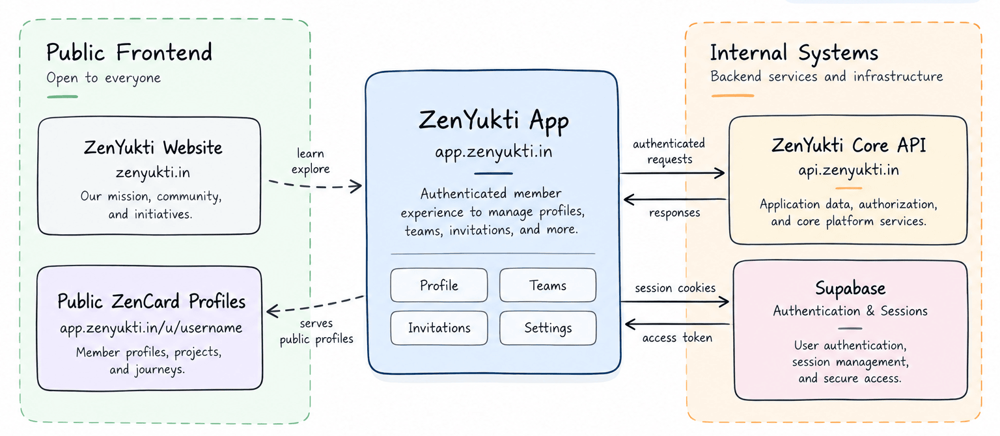
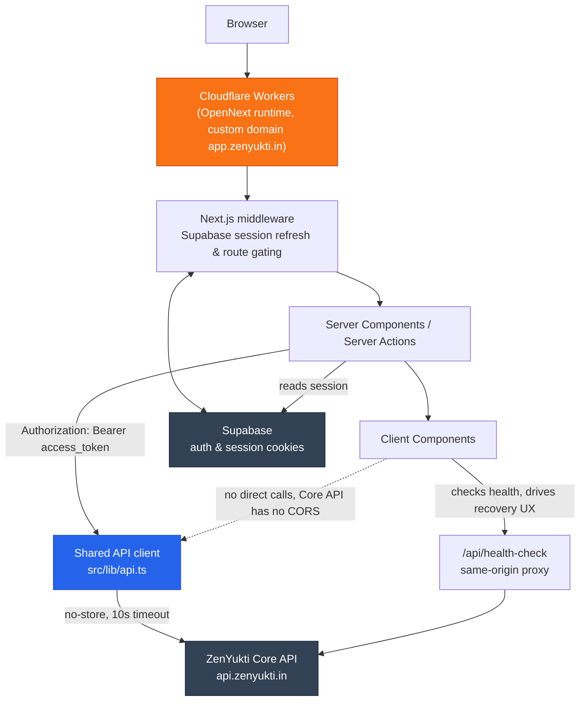

# ZenYukti App

> ZenYukti is a technology ecosystem where people learn, build, connect, and share — together.

The production web application for ZenYukti members: sign in, manage profiles and teams, handle invitations, and publish public ZenCard profiles. This is a real production application, not a demo or starter project.

**Live app:** [app.zenyukti.in](https://app.zenyukti.in) · **API:** [api.zenyukti.in](https://api.zenyukti.in)

## At a glance

| | |
|---|---|
| **Framework** | Next.js 16 · App Router |
| **Runtime** | Cloudflare Workers · OpenNext |
| **Authentication** | Supabase sessions |
| **Data platform** | ZenYukti Core API |
| **Status** | Production · `app.zenyukti.in` |

## What is this repository?

`zenyukti-app` is the authenticated application layer for the ZenYukti ecosystem. It owns the member-facing experience while the private Core / OS API owns application data and authorization.

It provides:

- Profile and featured-work management
- Member directory and team views
- Invitation issuance, revocation, reissuance, and acceptance
- Public ZenCard profiles with skills, work, and journey
- Role-aware member, title, join-date, team-listing, and journey management

## Ecosystem

This repository is one product surface in a larger ecosystem. The website, app, public ZenCards, Women, and Recruitment surfaces are separate products; the Core / OS API is a private platform dependency rather than part of this codebase.



- **ZenYukti Website** (`zenyukti.in`) — public marketing site and separate product surface.
- **ZenYukti App** (`app.zenyukti.in`, *this repository*) — authenticated member experience and host for `/u/[username]` ZenCards.
- **ZenYukti Core / OS** (`api.zenyukti.in`) — private platform/API dependency; it is not part of this repository.
- **ZenYukti Women** and **ZenYukti Recruitment** — separate ecosystem product surfaces.

## Architecture

The app is a Next.js 16 App Router application deployed to Cloudflare Workers through OpenNext. Supabase manages authentication, and the Core API supplies application data.



**Request flow.** The browser talks to the Cloudflare Worker, not directly to the Core API. Middleware refreshes the Supabase session and gates private routes; Server Components and Server Actions read that session, attach its access token as a bearer token, and call the Core API through `src/lib/api.ts`. Writes stay server-side because the Core API does not provide CORS headers.

Supabase stores sessions in cookies, while the Core API independently verifies the Supabase JWT and enforces authorization. The app uses permissions and standing data to control UI affordances, but those checks are not a substitute for API authorization.

## API

All application data comes from the ZenYukti Core API. Server Components, Server Actions, and the health-check route call it through the shared client in `src/lib/api.ts`; the browser never calls it directly.

<details>
<summary>View the complete endpoint contract</summary>

All paths below are Core API paths unless noted otherwise. `yes` means a Supabase bearer token is required.

### Authentication / current user
| Method | Path | Auth | Purpose |
|---|---|---|---|
| GET | `/v1/me` | yes | Current user identity |
| GET | `/v1/me/permissions` | yes | Current user's permission set |
| GET | `/v1/me/roles` | yes | Current user's roles |

### Profiles
| Method | Path | Auth | Purpose |
|---|---|---|---|
| GET | `/v1/me/profile` | yes | Own profile |
| PATCH | `/v1/me/profile` | yes | Update own profile |
| GET | `/v1/me/featured-work` | yes | List own featured work |
| POST | `/v1/me/featured-work` | yes | Create featured work item |
| PATCH | `/v1/me/featured-work/{id}` | yes | Update featured work item |
| DELETE | `/v1/me/featured-work/{id}` | yes | Delete featured work item |

### Teams / members
| Method | Path | Auth | Purpose |
|---|---|---|---|
| GET | `/v1/users` | yes | Member directory list |
| GET | `/v1/users/{id}` | yes | Member detail |
| PATCH | `/v1/users/{id}/title` | yes | Set a member's official title |
| PATCH | `/v1/users/{id}/member-since` | yes | Set a member's join date |
| PATCH | `/v1/users/{id}/public-team-membership` | yes | Manage public team listing |
| GET | `/v1/users/{id}/journey` | yes | Fetch a member's journey entries |
| POST | `/v1/users/{id}/journey` | yes | Add a journey entry |
| PATCH | `/v1/users/{id}/journey/{entryId}` | yes | Update a journey entry |
| DELETE | `/v1/users/{id}/journey/{entryId}` | yes | Delete a journey entry |

### Invitations
| Method | Path | Auth | Purpose |
|---|---|---|---|
| GET | `/v1/invitations` | yes | List invitations |
| POST | `/v1/invitations` | yes | Issue an invitation |
| POST | `/v1/invitations/{id}/revoke` | yes | Revoke an invitation |
| GET | `/v1/invitations/lookup?token=` | no | Resolve an invite token for the accept page |
| POST | `/v1/invitations/accept` | no | Accept an invitation |

### Public profiles / ZenCards
| Method | Path | Auth | Purpose |
|---|---|---|---|
| GET | `/v1/profiles/u/{username}` | no | Full public ZenCard payload |

### Health
| Method | Path | Auth | Purpose |
|---|---|---|---|
| GET | `/healthz` | no | Core API liveness (proxied same-origin via `/api/health-check`) |

</details>

## API availability & recovery

The Core API can cold-start. The app distinguishes ordinary application errors from infrastructure unavailability: 502/503/504 responses, network failures, and timeouts become `ApiUnavailableError`; ordinary non-2xx responses remain `ApiError`.

When the initial user and permissions request is unavailable, `ApiBootGate` shows a recovery dialog and polls the same-origin `/api/health-check` route. Once `/healthz` reports healthy, the app refreshes the server-rendered tree automatically. Ordinary `ApiError` responses remain inline page errors.

<details>
<summary>Implementation details</summary>

- **`ApiError`** — the Core API responded with an ordinary non-2xx HTTP status (e.g. 403, 404, 422). The app treats this as a real application-level error.
- **`ApiUnavailableError`** — the request failed at the network level, timed out after the shared client's 10-second limit, or returned a gateway status (502/503/504). This usually indicates that the API is warming up.
- The initial `/v1/me` and `/v1/me/permissions` requests activate `ApiBootGate` when unavailable. It polls roughly every 8 seconds and refreshes the server-rendered tree after recovery.

</details>

## Development

### Prerequisites

Node.js, npm, and access to a Supabase project for local auth or ZenYukti-provided credentials.

| Variable | Exposure | Purpose |
|---|---|---|
| `NEXT_PUBLIC_SUPABASE_URL` | public (client-exposed) | Supabase project URL, used for auth/session only |
| `NEXT_PUBLIC_SUPABASE_ANON_KEY` | public (client-exposed) | Supabase anonymous key |
| `NEXT_PUBLIC_API_BASE_URL` | public (client-exposed) | Base URL of the Core API (`https://api.zenyukti.in`) |

Production configuration is managed by Cloudflare and is not committed to the repository. `.env.local` and `.dev.vars` are ignored; only example templates are intended for Git.

```bash
npm install
cp .env.local.example .env.local
# fill in NEXT_PUBLIC_SUPABASE_URL and NEXT_PUBLIC_SUPABASE_ANON_KEY
npm run dev
```

The app runs at `http://localhost:3000`. The OpenNext Cloudflare integration keeps local development aligned with production edge-runtime constraints.

Useful commands:

```bash
npm run lint
npm run build
npm run test
npm run preview
```

## Deployment

The application is deployed to **Cloudflare Workers** using [OpenNext](https://opennext.js.org/cloudflare), with `app.zenyukti.in` configured in `wrangler.jsonc`. It depends on the Core API for application data and Supabase for authentication.

```bash
npm run deploy
```

Deployment credentials and account-level configuration are managed outside this repository, through the deployment environment.

## Security

- No secrets are committed to this repository. All `.env*` files except the `.example` templates are gitignored.
- The public Supabase anon key is used for authentication only; this app has no direct database access.
- Authenticated Core API requests carry the Supabase session access token as a bearer token.
- The private Core API and database boundary are separate from this repository.
- Production credentials and deployment configuration are managed through the deployment environment, not through Git.
- Report security concerns privately to the ZenYukti team rather than publishing exploit details.

## Contributing

This repository is public for transparency and engineering collaboration; it serves real ZenYukti team members in production.

- Keep changes focused; prefer small, reviewable pull requests.
- Preserve production stability — this app is live at `app.zenyukti.in`.
- Understand the API contract above before changing request/response handling.
- Never commit credentials, tokens, or `.env` files.
- Discuss significant changes before starting so scope can be agreed on first.

## License

Copyright © 2026 ZenYukti. All rights reserved.

This repository is publicly available for viewing and reference only.
The source code may not be copied, modified, distributed, sublicensed,
or used commercially without explicit written permission from ZenYukti.

This project is not open source.
